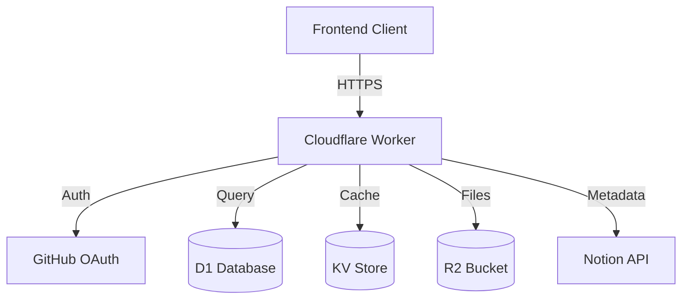

# Design Document

## Overview

Cloudflare Workers 기반의 서버리스 백엔드 시스템으로, Hono 프레임워크를 사용하여 RESTful API를 제공합니다. Notion을 CMS로 활용하여 자료 메타데이터를 관리하고, R2를 파일 스토리지로 사용하며, D1 SQLite 데이터베이스로 사용자 및 마일리지 데이터를 관리합니다.

### Technology Stack

- **Runtime**: Cloudflare Workers
- **Framework**: Hono (lightweight web framework)
- **Database**: Cloudflare D1 (SQLite)
- **Cache**: Cloudflare KV
- **Storage**: Cloudflare R2
- **CMS**: Notion API
- **Authentication**: JWT (jsonwebtoken)
- **Language**: TypeScript

## Architecture

### System Architecture



### Request Flow

1. **Authentication Flow**
   - Client → Worker: GitHub OAuth code
   - Worker → GitHub: Exchange code for token
   - Worker → D1: Create/retrieve user
   - Worker → Client: JWT token

2. **Resource Browse Flow**
   - Client → Worker: GET /api/resources
   - Worker → KV: Check cache
   - If cache miss → Worker → Notion: Query approved resources
   - Worker → KV: Store cache (5 min TTL)
   - Worker → Client: Resource list

3. **Download Flow**
   - Client → Worker: POST /api/resources/:id/download
   - Worker: Verify JWT
   - Worker → D1: Check mileage balance
   - Worker → D1: Deduct mileage
   - Worker → R2: Generate signed URL (600s)
   - Worker → Notion: Increment download count
   - Worker → Client: Download URL

4. **Upload Flow**
   - Client → Worker: POST /api/resources/upload
   - Worker: Verify JWT
   - Worker → R2: Upload file
   - Worker → Notion: Create entry (status: 대기)
   - Worker → D1: Award mileage (+50)
   - Worker → Client: Upload confirmation

## Components and Interfaces

### API Routes

#### Authentication Routes (`/api/auth`)

```typescript
// POST /api/auth/github
interface GitHubAuthRequest {
  code: string
}

interface GitHubAuthResponse {
  token: string
  user: {
    id: string
    githubId: string
    username: string
    email: string
    avatarUrl: string
    mileage: number
  }
}

// GET /api/auth/me
interface MeResponse {
  user: {
    id: string
    username: string
    email: string
    avatarUrl: string
    mileage: number
    role: 'user' | 'admin'
  }
}
```

#### Resource Routes (`/api/resources`)

```typescript
// GET /api/resources
interface ResourceListRequest {
  page?: number
  limit?: number
  category?: string
  level?: string
}

interface ResourceListResponse {
  resources: Resource[]
  hasMore: boolean
  nextCursor?: string
}

interface Resource {
  id: string
  title: string
  description: string
  fileKey: string
  category: string
  level: string
  requiredMileage: number
  fileSize: string
  uploadedBy: string
  uploadedAt: string
  views: number
  downloads: number
}

// GET /api/resources/:id
interface ResourceDetailResponse {
  resource: Resource
}

// POST /api/resources/:id/download
interface DownloadResponse {
  downloadUrl: string
  expiresIn: number
}

// POST /api/resources/upload
interface UploadRequest {
  file: File
  title: string
  description: string
  category: string
  level: string
  requiredMileage: number
  copyrightConfirmed: boolean
  license: string
}

interface UploadResponse {
  resourceId: string
  fileKey: string
  status: 'pending'
}
```

#### User Routes (`/api/users`)

```typescript
// GET /api/users/me/mileage
interface MileageResponse {
  balance: number
  transactions: Transaction[]
}

interface Transaction {
  id: string
  type: 'earn' | 'spend'
  amount: number
  description: string
  resourceTitle?: string
  createdAt: string
}
```

#### Admin Routes (`/api/admin`)

```typescript
// GET /api/admin/resources/pending
interface PendingResourcesResponse {
  resources: Resource[]
}

// POST /api/admin/resources/:id/approve
interface ApproveResponse {
  success: boolean
  resourceId: string
}

// POST /api/admin/resources/:id/reject
interface RejectRequest {
  reason: string
}

interface RejectResponse {
  success: boolean
  resourceId: string
}
```

#### Health Check Route

```typescript
// GET /api/health
interface HealthResponse {
  status: 'healthy' | 'degraded' | 'unhealthy'
  services: {
    d1: { status: 'up' | 'down', responseTime: number }
    kv: { status: 'up' | 'down', responseTime: number }
    r2: { status: 'up' | 'down', responseTime: number }
  }
  timestamp: string
}

// Implementation
async function healthCheck(c: Context): Promise<Response> {
  const services = {
    d1: { status: 'down' as 'up' | 'down', responseTime: 0 },
    kv: { status: 'down' as 'up' | 'down', responseTime: 0 },
    r2: { status: 'down' as 'up' | 'down', responseTime: 0 }
  }
  
  // Test D1 connectivity
  const d1Start = Date.now()
  try {
    await c.env.DB.prepare('SELECT 1').first()
    services.d1 = { status: 'up', responseTime: Date.now() - d1Start }
  } catch (e) {
    services.d1 = { status: 'down', responseTime: 0 }
  }
  
  // Test KV connectivity
  const kvStart = Date.now()
  try {
    await c.env.CACHE.get('health-check-test')
    services.kv = { status: 'up', responseTime: Date.now() - kvStart }
  } catch (e) {
    services.kv = { status: 'down', responseTime: 0 }
  }
  
  // Test R2 connectivity
  const r2Start = Date.now()
  try {
    await c.env.BUCKET.head('health-check-test')
    services.r2 = { status: 'up', responseTime: Date.now() - r2Start }
  } catch (e) {
    services.r2 = { status: 'down', responseTime: 0 }
  }
  
  const allHealthy = Object.values(services).every(s => s.status === 'up')
  
  return c.json({
    status: allHealthy ? 'healthy' : 'degraded',
    services,
    timestamp: new Date().toISOString()
  }, 200) // Always return 200 as per requirement
}
```

### Middleware

#### Authentication Middleware

```typescript
interface JWTPayload {
  userId: string
  role: 'user' | 'admin'
  iat: number
  exp: number
}

// Verifies JWT token and attaches user to context
async function authMiddleware(c: Context, next: Next) {
  const token = c.req.header('Authorization')?.replace('Bearer ', '')
  if (!token) throw new UnauthorizedError()
  
  const payload = await verifyJWT(token, c.env.JWT_SECRET)
  c.set('user', payload)
  await next()
}
```

#### Admin Middleware

```typescript
// Verifies user has admin role
async function adminMiddleware(c: Context, next: Next) {
  const user = c.get('user')
  if (user.role !== 'admin') throw new ForbiddenError()
  await next()
}
```

#### Rate Limit Middleware

```typescript
// Limits requests to 100 per minute per user
async function rateLimitMiddleware(c: Context, next: Next) {
  const userId = c.get('user')?.userId || c.req.header('CF-Connecting-IP')
  const key = `ratelimit:${userId}`
  
  const count = await c.env.CACHE.get(key)
  if (count && parseInt(count) >= 100) {
    throw new RateLimitError()
  }
  
  await c.env.CACHE.put(key, String((parseInt(count || '0') + 1)), {
    expirationTtl: 60
  })
  
  await next()
}
```

#### CORS Middleware

```typescript
// Enables CORS for frontend
function corsMiddleware() {
  return cors({
    origin: ['http://localhost:5173', 'https://korean-teacher.pages.dev'],
    allowMethods: ['GET', 'POST', 'PUT', 'DELETE', 'OPTIONS'],
    allowHeaders: ['Content-Type', 'Authorization'],
    credentials: true
  })
}
```

## Data Models

### D1 Database Schema

```sql
-- Users table
CREATE TABLE users (
  id TEXT PRIMARY KEY,
  github_id TEXT UNIQUE NOT NULL,
  username TEXT NOT NULL,
  email TEXT,
  avatar_url TEXT,
  role TEXT DEFAULT 'user' CHECK(role IN ('user', 'admin')),
  mileage INTEGER DEFAULT 100, -- Initial onboarding mileage
  created_at DATETIME DEFAULT CURRENT_TIMESTAMP,
  updated_at DATETIME DEFAULT CURRENT_TIMESTAMP
);

CREATE INDEX idx_users_github_id ON users(github_id);
CREATE INDEX idx_users_email ON users(email);

-- Mileage transactions table
CREATE TABLE mileage_transactions (
  id TEXT PRIMARY KEY,
  user_id TEXT NOT NULL,
  type TEXT NOT NULL CHECK(type IN ('earn', 'spend')),
  amount INTEGER NOT NULL,
  description TEXT NOT NULL,
  resource_id TEXT,
  resource_title TEXT,
  created_at DATETIME DEFAULT CURRENT_TIMESTAMP,
  FOREIGN KEY (user_id) REFERENCES users(id)
);

CREATE INDEX idx_transactions_user_id ON mileage_transactions(user_id);
CREATE INDEX idx_transactions_created_at ON mileage_transactions(created_at);

-- Resource cache table (for quick lookups)
CREATE TABLE resource_cache (
  notion_id TEXT PRIMARY KEY,
  file_key TEXT NOT NULL,
  required_mileage INTEGER NOT NULL,
  cached_at DATETIME DEFAULT CURRENT_TIMESTAMP
);

CREATE INDEX idx_resource_cache_file_key ON resource_cache(file_key);
```

### Notion Database Properties

```typescript
interface NotionResourceProperties {
  제목: { title: [{ text: { content: string } }] }
  설명: { rich_text: [{ text: { content: string } }] }
  파일키: { rich_text: [{ text: { content: string } }] }
  카테고리: { select: { name: string } }
  난이도: { select: { name: string } }
  필요마일리지: { number: number }
  파일크기: { rich_text: [{ text: { content: string } }] }
  상태: { select: { name: '대기' | '승인' | '거절' } }
  업로더: { rich_text: [{ text: { content: string } }] }
  업로드일: { date: { start: string } }
  조회수: { number: number }
  다운로드수: { number: number }
}
```

## Service Layer

### NotionService

```typescript
class NotionService {
  private client: Client
  private databaseId: string
  
  constructor(apiKey: string, databaseId: string)
  
  // Query approved resources with caching
  async getApprovedResources(
    limit: number,
    cursor?: string,
    filters?: { category?: string, level?: string }
  ): Promise<{ resources: Resource[], hasMore: boolean, nextCursor?: string }>
  
  // Get single resource by ID
  async getResource(pageId: string): Promise<Resource>
  
  // Create new resource entry
  async createResource(data: CreateResourceData): Promise<string>
  
  // Update resource status
  async updateResourceStatus(
    pageId: string,
    status: '승인' | '거절'
  ): Promise<void>
  
  // Increment download count
  async incrementDownloadCount(pageId: string): Promise<void>
  
  // Get pending resources for admin
  async getPendingResources(): Promise<Resource[]>
  
  // Retry logic with exponential backoff
  private async retryWithBackoff<T>(
    fn: () => Promise<T>,
    retries: number = 3
  ): Promise<T>
}
```

### R2Service

```typescript
class R2Service {
  private bucket: R2Bucket
  
  constructor(bucket: R2Bucket)
  
  // Upload file to R2
  async uploadFile(
    fileKey: string,
    file: ArrayBuffer,
    metadata: { contentType: string, size: number }
  ): Promise<void>
  
  // Generate signed download URL
  async getSignedUrl(
    fileKey: string,
    expiresIn: number = 600 // 600 seconds (10 minutes) as per requirement
  ): Promise<string>
  
  // Check if file exists
  async fileExists(fileKey: string): Promise<boolean>
  
  // Delete file
  async deleteFile(fileKey: string): Promise<void>
  
  // Generate unique file key
  generateFileKey(originalFilename: string): string {
    const date = new Date()
    const year = date.getFullYear()
    const month = String(date.getMonth() + 1).padStart(2, '0')
    const uuid = crypto.randomUUID()
    const ext = originalFilename.split('.').pop()
    const name = originalFilename.replace(/\.[^/.]+$/, '')
    return `${year}/${month}/${name}-${uuid}.${ext}`
  }
}
```

### AuthService

```typescript
class AuthService {
  private jwtSecret: string
  
  constructor(jwtSecret: string)
  
  // Exchange GitHub code for access token
  async exchangeGitHubCode(
    code: string,
    clientId: string,
    clientSecret: string
  ): Promise<string>
  
  // Get GitHub user info
  async getGitHubUser(accessToken: string): Promise<GitHubUser>
  
  // Create or update user in D1
  async upsertUser(
    db: D1Database,
    githubUser: GitHubUser
  ): Promise<User>
  
  // Generate JWT token
  // Note: Token storage in localStorage is handled by frontend client
  async generateJWT(user: User, expiryDays: number = 7): Promise<string> {
    const payload: JWTPayload = {
      userId: user.id,
      role: user.role,
      iat: Math.floor(Date.now() / 1000),
      exp: Math.floor(Date.now() / 1000) + (expiryDays * 24 * 60 * 60)
    }
    return await sign(payload, this.jwtSecret)
  }
  
  // Verify JWT token
  async verifyJWT(token: string): Promise<JWTPayload>
}
```

### MileageService

```typescript
class MileageService {
  private db: D1Database
  
  constructor(db: D1Database)
  
  // Get user mileage balance
  async getBalance(userId: string): Promise<number>
  
  // Get transaction history
  async getTransactions(
    userId: string,
    limit: number = 50
  ): Promise<Transaction[]>
  
  // Add mileage (for uploads, rewards)
  async addMileage(
    userId: string,
    amount: number,
    description: string,
    resourceId?: string,
    resourceTitle?: string
  ): Promise<void>
  
  // Deduct mileage (for downloads)
  async deductMileage(
    userId: string,
    amount: number,
    description: string,
    resourceId: string,
    resourceTitle: string
  ): Promise<void>
  
  // Check if user has sufficient mileage
  async hasSufficientMileage(
    userId: string,
    required: number
  ): Promise<boolean>
  
  // Execute mileage transaction atomically
  private async executeTransaction(
    userId: string,
    type: 'earn' | 'spend',
    amount: number,
    description: string,
    resourceId?: string,
    resourceTitle?: string
  ): Promise<void>
}
```

## Error Handling

### Error Classes

```typescript
class APIError extends Error {
  constructor(
    public statusCode: number,
    public code: string,
    message: string,
    public details?: any
  ) {
    super(message)
    this.name = 'APIError'
  }
}

class UnauthorizedError extends APIError {
  constructor(message = 'Unauthorized') {
    super(401, 'UNAUTHORIZED', message)
  }
}

class ForbiddenError extends APIError {
  constructor(message = 'Forbidden') {
    super(403, 'FORBIDDEN', message)
  }
}

class InsufficientMileageError extends APIError {
  constructor(required: number, current: number) {
    super(
      402,
      'INSUFFICIENT_MILEAGE',
      `Insufficient mileage. Required: ${required}, Current: ${current}`,
      { required, current }
    )
  }
}

class NotFoundError extends APIError {
  constructor(resource: string) {
    super(404, 'NOT_FOUND', `${resource} not found`)
  }
}

class RateLimitError extends APIError {
  constructor() {
    super(429, 'RATE_LIMIT_EXCEEDED', 'Too many requests')
  }
}

class ServiceUnavailableError extends APIError {
  constructor(service: string) {
    super(503, 'SERVICE_UNAVAILABLE', `${service} is unavailable`)
  }
}

class StorageError extends APIError {
  constructor(message = 'R2 storage error') {
    super(500, 'STORAGE_ERROR', message)
  }
}
```

### Error Handler Middleware

```typescript
async function errorHandler(err: Error, c: Context) {
  console.error('Error:', err)
  
  if (err instanceof APIError) {
    return c.json({
      error: {
        code: err.code,
        message: err.message,
        details: err.details,
        timestamp: new Date().toISOString()
      }
    }, err.statusCode)
  }
  
  // Unknown errors
  return c.json({
    error: {
      code: 'INTERNAL_SERVER_ERROR',
      message: 'An unexpected error occurred',
      timestamp: new Date().toISOString()
    }
  }, 500)
}
```

## Testing Strategy

### Unit Tests

```typescript
// Test service layer methods
describe('MileageService', () => {
  test('should deduct mileage correctly', async () => {
    const service = new MileageService(mockDB)
    await service.deductMileage('user1', 30, 'Download', 'res1', 'Resource')
    const balance = await service.getBalance('user1')
    expect(balance).toBe(70) // assuming initial balance was 100
  })
  
  test('should throw error when insufficient mileage', async () => {
    const service = new MileageService(mockDB)
    await expect(
      service.deductMileage('user1', 200, 'Download', 'res1', 'Resource')
    ).rejects.toThrow(InsufficientMileageError)
  })
})

describe('R2Service', () => {
  test('should generate correct file key format', () => {
    const service = new R2Service(mockBucket)
    const key = service.generateFileKey('test-file.pdf')
    expect(key).toMatch(/^\d{4}\/\d{2}\/test-file-[a-f0-9-]+\.pdf$/)
  })
})
```

### Integration Tests

```typescript
// Test API endpoints with Miniflare
describe('Resource API', () => {
  test('GET /api/resources should return approved resources', async () => {
    const res = await app.request('/api/resources')
    expect(res.status).toBe(200)
    const data = await res.json()
    expect(data.resources).toBeInstanceOf(Array)
  })
  
  test('POST /api/resources/:id/download should require auth', async () => {
    const res = await app.request('/api/resources/123/download', {
      method: 'POST'
    })
    expect(res.status).toBe(401)
  })
  
  test('POST /api/resources/:id/download should deduct mileage', async () => {
    const token = await generateTestToken()
    const res = await app.request('/api/resources/123/download', {
      method: 'POST',
      headers: { Authorization: `Bearer ${token}` }
    })
    expect(res.status).toBe(200)
    const data = await res.json()
    expect(data.downloadUrl).toBeDefined()
  })
})
```

### Local Development Testing

```bash
# Run D1 migrations
wrangler d1 execute korean-teacher-db --local --file=./schema.sql

# Seed test data
wrangler d1 execute korean-teacher-db --local --file=./seed.sql

# Start dev server
wrangler dev

# Run tests
npm test

# Test with curl
curl http://localhost:8787/api/health
curl -H "Authorization: Bearer <token>" http://localhost:8787/api/resources
```

## Deployment Configuration

### wrangler.toml

```toml
name = "korean-teacher-api"
main = "src/index.ts"
compatibility_date = "2024-01-01"
node_compat = true

[[kv_namespaces]]
binding = "CACHE"
id = "your-kv-namespace-id"
preview_id = "your-preview-kv-id"

[[d1_databases]]
binding = "DB"
database_name = "korean-teacher-db"
database_id = "your-database-id"

[[r2_buckets]]
binding = "BUCKET"
bucket_name = "korean-teacher-resources"
preview_bucket_name = "korean-teacher-resources-preview"

[vars]
ENVIRONMENT = "production"
NOTION_DATABASE_ID = "your-notion-database-id"
GITHUB_CLIENT_ID = "your-github-client-id"

# Secrets (set via wrangler secret put)
# JWT_SECRET
# NOTION_API_KEY
# GITHUB_CLIENT_SECRET
```

### Environment Variables

```bash
# Development (.dev.vars)
JWT_SECRET=dev-secret-key
NOTION_API_KEY=secret_xxx
NOTION_DATABASE_ID=xxx
GITHUB_CLIENT_ID=xxx
GITHUB_CLIENT_SECRET=xxx
ENVIRONMENT=development

# Production (wrangler secrets)
wrangler secret put JWT_SECRET
wrangler secret put NOTION_API_KEY
wrangler secret put GITHUB_CLIENT_SECRET
```

## Performance Optimizations

### Caching Strategy

1. **Resource List Cache** (KV, 5 min TTL)
   - Key: `resources:approved:page:{page}:category:{category}:level:{level}`
   - Invalidate on: Resource approval/rejection

2. **Resource Detail Cache** (KV, 10 min TTL)
   - Key: `resource:{notionId}`
   - Invalidate on: Resource update

3. **User Mileage Cache** (KV, 1 min TTL)
   - Key: `mileage:{userId}`
   - Invalidate on: Transaction

### Database Optimization

- Use indexes on frequently queried columns
- Batch insert mileage transactions
- Use prepared statements for repeated queries
- Implement connection pooling (D1 handles this)

### API Optimization

- Implement pagination for all list endpoints
- Use cursor-based pagination for Notion queries
- Compress responses with gzip
- Set appropriate cache headers
- Use ETags for conditional requests

## Security Considerations

1. **Authentication**
   - JWT tokens with 7-day expiration
   - Secure token storage (httpOnly cookies recommended for web)
   - Token refresh mechanism

2. **Authorization**
   - Role-based access control (user/admin)
   - Resource-level permissions
   - Rate limiting per user

3. **File Upload**
   - Validate file size (max 100MB)
   - Validate file types
   - Scan for malware (future enhancement)
   - Generate unique file keys to prevent collisions

4. **API Security**
   - CORS configuration
   - CSRF protection
   - Input validation and sanitization
   - SQL injection prevention (parameterized queries)

5. **Secrets Management**
   - Use Wrangler secrets for sensitive data
   - Never commit secrets to repository
   - Rotate secrets regularly
