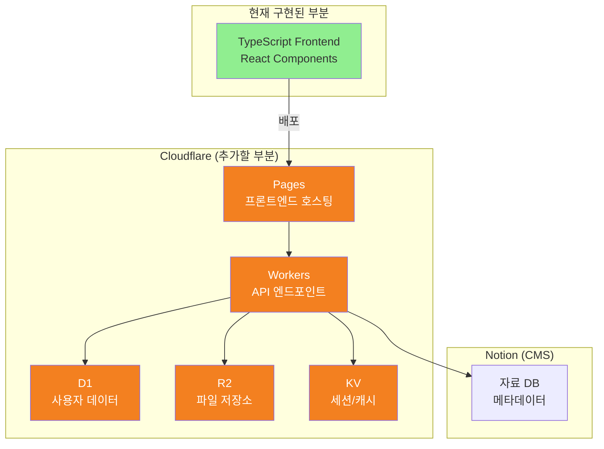

# 🚀 Cloudflare + Notion 서버리스 아키텍처 마이그레이션 계획

> 작성일: 2025-11-09  
> 작성자: @Jasujung99  
> 현재 상태: 프론트엔드 구현 완료, 백엔드 미구현  
> 목표: 서버 관리 없는 완전한 서버리스 아키텍처 구축

## 📌 핵심 요약

현재 TypeScript/React 기반 프론트엔드만 구현된 상태에서, 전통적인 서버(DigitalOcean) 대신 **Cloudflare의 서버리스 스택**을 선택하여:
- **월 운영비 95% 절감** (예상: $108 → $5)
- **서버 관리 부담 완전 제거**
- **글로벌 3ms 응답 속도**
- **무제한 파일 다운로드 (비용 $0)**

## 🎯 왜 Cloudflare + Notion인가?

### 현재 상황 분석
```yaml
구현 완료:
  - TypeScript 기반 프론트엔드 (92.7%)
  - UI 컴포넌트
  - 라우팅 구조

미구현 (기회):
  - 백엔드 API ✅ (처음부터 서버리스로!)
  - 데이터베이스 ✅ (D1으로 시작)
  - 파일 저장소 ✅ (R2로 비용 절감)
  - 인증 시스템 ✅ (Workers로 구현)
```

**핵심: 백엔드가 아직 없다는 것은 레거시 없이 최신 기술로 시작할 수 있는 절호의 기회입니다.**

## 🏗️ 목표 아키텍처



## 📊 비용 비교 (월 2000명 기준)

| 항목 | 전통적 서버 (DO/AWS) | Cloudflare | 절감률 |
|------|---------------------|------------|--------|
| 컴퓨팅 | $48 | $5 | -90% |
| 데이터베이스 | $15 | $0 | -100% |
| 파일 저장 | $25 | $0.30 | -99% |
| 트래픽 (200GB) | $20 | **$0** | -100% |
| **총 월 비용** | **$108** | **$5.30** | **-95%** |

## 🗓️ 구현 로드맵

### Phase 0: 준비 (현재)
✅ TypeScript 프론트엔드 구현 완료  
✅ 컴포넌트 구조 확립  
✅ GitHub 레포지토리 설정  

### Phase 1: Cloudflare 기초 설정 (Week 1)

#### 1.1 계정 및 프로젝트 설정
```bash
# Cloudflare 계정 생성 후
npm install -g wrangler
wrangler login

# 프로젝트 초기화
wrangler init korean-teacher-api
cd korean-teacher-api
```

#### 1.2 Pages 연동 (프론트엔드 배포)
1. Cloudflare Dashboard → Pages → Create Project
2. GitHub 연동 → `Jasujung99/korean-teacher-commu` 선택
3. Build 설정:
   ```yaml
   Build command: npm run build
   Build output directory: /dist
   ```
4. 환경 변수 설정 (필요시)

### Phase 2: 핵심 백엔드 구현 (Week 2-3)

#### 2.1 Workers API 구조
```typescript name=workers/src/index.ts
import { Hono } from 'hono'
import { cors } from 'hono/cors'
import { jwt } from 'hono/jwt'

const app = new Hono<{ Bindings: Env }>()

// CORS 설정
app.use('*', cors())

// JWT 인증 미들웨어
app.use('/api/protected/*', jwt({ secret: 'your-secret' }))

// 라우트 정의
app.get('/api/health', (c) => c.json({ status: 'ok' }))

// 사용자 관련
app.post('/api/auth/github', async (c) => {
  // GitHub OAuth 처리
})

app.get('/api/users/:id', async (c) => {
  const { id } = c.req.param()
  const user = await c.env.DB.prepare(
    'SELECT * FROM users WHERE id = ?'
  ).bind(id).first()
  return c.json(user)
})

// 자료실 관련
app.get('/api/resources', async (c) => {
  // 1. Notion에서 메타데이터 가져오기 (캐싱)
  const cached = await c.env.KV.get('resources-list')
  if (cached) return c.json(JSON.parse(cached))
  
  // 2. Notion API 호출
  const resources = await fetchFromNotion(c.env.NOTION_API_KEY)
  
  // 3. 5분간 캐싱
  await c.env.KV.put('resources-list', JSON.stringify(resources), {
    expirationTtl: 300
  })
  
  return c.json(resources)
})

// 파일 다운로드 (저작권 보호)
app.get('/api/download/:resourceId', async (c) => {
  const { resourceId } = c.req.param()
  const userId = c.get('jwtPayload').sub
  
  // 1. 마일리지 확인
  const user = await c.env.DB.prepare(
    'SELECT mileage FROM users WHERE id = ?'
  ).bind(userId).first()
  
  if (user.mileage < 30) {
    return c.json({ error: '마일리지 부족' }, 403)
  }
  
  // 2. Notion에서 파일 정보 가져오기
  const fileKey = await getFileKeyFromNotion(resourceId)
  
  // 3. R2에서 임시 다운로드 URL 생성
  const url = await c.env.BUCKET.createSignedUrl(fileKey, {
    expiresIn: 300 // 5분
  })
  
  // 4. 마일리지 차감
  await c.env.DB.prepare(
    'UPDATE users SET mileage = mileage - 30 WHERE id = ?'
  ).bind(userId).run()
  
  return c.redirect(url)
})

export default app
```

#### 2.2 D1 데이터베이스 스키마
```sql name=schema.sql
-- 사용자 테이블
CREATE TABLE users (
  id TEXT PRIMARY KEY,
  github_id TEXT UNIQUE NOT NULL,
  email TEXT UNIQUE,
  display_name TEXT NOT NULL,
  role TEXT DEFAULT 'TEACHER',
  mileage INTEGER DEFAULT 100,
  verified_at DATETIME,
  created_at DATETIME DEFAULT CURRENT_TIMESTAMP
);

-- 마일리지 거래 내역
CREATE TABLE mileage_transactions (
  id TEXT PRIMARY KEY,
  user_id TEXT NOT NULL,
  amount INTEGER NOT NULL,
  type TEXT NOT NULL, -- EARN, SPEND
  reason TEXT,
  created_at DATETIME DEFAULT CURRENT_TIMESTAMP,
  FOREIGN KEY (user_id) REFERENCES users(id)
);

-- 다운로드 기록
CREATE TABLE download_history (
  id TEXT PRIMARY KEY,
  user_id TEXT NOT NULL,
  resource_id TEXT NOT NULL,
  downloaded_at DATETIME DEFAULT CURRENT_TIMESTAMP,
  FOREIGN KEY (user_id) REFERENCES users(id)
);

-- 인덱스
CREATE INDEX idx_users_github_id ON users(github_id);
CREATE INDEX idx_transactions_user_id ON mileage_transactions(user_id);
CREATE INDEX idx_downloads_user_id ON download_history(user_id);
```

#### 2.3 Notion 데이터베이스 구조
```yaml
자료실 Database:
  properties:
    제목: title
    설명: rich_text
    파일키: text (R2 object key)
    카테고리: select
      - 문법
      - 회화
      - 읽기
      - 쓰기
    난이도: select
      - 초급
      - 중급
      - 고급
    필요_마일리지: number
    상태: select
      - 대기
      - 승인
      - 거절
    파일_크기: text (예: "45MB")
    업로드_일자: date
```

### Phase 3: 파일 저장소 구현 (Week 3)

#### 3.1 R2 버킷 설정
```bash
# R2 버킷 생성
wrangler r2 bucket create korean-teacher-resources

# wrangler.toml에 바인딩 추가
[[r2_buckets]]
binding = "BUCKET"
bucket_name = "korean-teacher-resources"
```

#### 3.2 파일 업로드 플로우
```typescript name=workers/src/upload.ts
// 관리자 전용 업로드 엔드포인트
app.post('/api/admin/upload', async (c) => {
  const formData = await c.req.formData()
  const file = formData.get('file') as File
  
  // 1. 파일 검증
  if (file.size > 100 * 1024 * 1024) {
    return c.json({ error: '100MB 초과' }, 400)
  }
  
  // 2. 고유 키 생성
  const key = `${Date.now()}-${file.name}`
  
  // 3. R2에 업로드
  await c.env.BUCKET.put(key, file.stream())
  
  // 4. Notion에 메타데이터 저장
  await createNotionEntry({
    title: file.name,
    fileKey: key,
    size: `${Math.round(file.size / 1024 / 1024)}MB`
  })
  
  return c.json({ success: true, key })
})
```

### Phase 4: 프론트엔드 연동 (Week 4)

#### 4.1 API 클라이언트 설정
```typescript name=src/lib/api.ts
const API_BASE = import.meta.env.VITE_API_URL || 'https://api.korean-teacher.com'

export const api = {
  // 인증
  async login(githubCode: string) {
    const res = await fetch(`${API_BASE}/api/auth/github`, {
      method: 'POST',
      body: JSON.stringify({ code: githubCode })
    })
    const { token } = await res.json()
    localStorage.setItem('token', token)
    return token
  },

  // 자료 목록
  async getResources() {
    const res = await fetch(`${API_BASE}/api/resources`)
    return res.json()
  },

  // 다운로드
  async downloadResource(id: string) {
    const token = localStorage.getItem('token')
    const res = await fetch(`${API_BASE}/api/download/${id}`, {
      headers: { Authorization: `Bearer ${token}` }
    })
    
    if (res.status === 403) {
      throw new Error('마일리지 부족')
    }
    
    // 리디렉션된 URL로 이동
    window.location.href = res.url
  }
}
```

#### 4.2 환경 변수 설정
```env name=.env.production
VITE_API_URL=https://api.korean-teacher.workers.dev
VITE_GITHUB_CLIENT_ID=your_github_oauth_app_id
```

## 📋 체크리스트

### 즉시 실행 (Day 1)
- [ ] Cloudflare 계정 생성
- [ ] GitHub 학생 혜택 활성화 (있다면)
- [ ] Wrangler CLI 설치
- [ ] 도메인 구매 또는 `.workers.dev` 사용 결정

### Week 1
- [ ] Cloudflare Pages에 현재 프론트엔드 배포
- [ ] Workers 프로젝트 초기화
- [ ] D1 데이터베이스 생성
- [ ] Notion API 키 발급

### Week 2-3
- [ ] 인증 시스템 구현
- [ ] 핵심 API 엔드포인트 구현
- [ ] Notion 연동 테스트
- [ ] R2 버킷 설정

### Week 4
- [ ] 프론트엔드-백엔드 연동
- [ ] 전체 플로우 테스트
- [ ] 성능 최적화
- [ ] 배포 및 모니터링 설정

## 💰 예상 비용 (MVP 단계)

```yaml
Cloudflare Workers:
  - 일 10만 요청까지: 무료
  - 초과 시: $5/월

Cloudflare D1:
  - 5GB까지: 무료
  - 읽기 500만 회/월: 무료

Cloudflare R2:
  - 저장: 10GB까지 무료
  - 다운로드: 완전 무료 (무제한)

Notion:
  - Personal Pro: 학생 무료
  - API: 무료

총 예상 월 비용: $0 ~ $5
```

## 🚨 주의사항 및 팁

### 1. Notion API Rate Limit
- 초당 3개 요청 제한
- **해결:** KV 스토어에 5분 캐싱 필수

### 2. D1 제한사항
- 현재 베타, 일부 SQL 기능 제한
- **해결:** 복잡한 쿼리는 애플리케이션 레벨에서 처리

### 3. Workers 크기 제한
- 압축 후 1MB 제한
- **해결:** 코드 스플리팅, 불필요한 의존성 제거

## 🎯 성공 지표

| 지표 | 목표 | 측정 방법 |
|------|------|-----------|
| 응답 속도 | < 50ms | Workers Analytics |
| 월 비용 | < $10 | Cloudflare 대시보드 |
| 가용성 | > 99.9% | Status Page |
| 개발 속도 | 주 2회 배포 | GitHub Actions |

## 📚 참고 자료

- [Cloudflare Workers 문서](https://developers.cloudflare.com/workers/)
- [D1 Database 가이드](https://developers.cloudflare.com/d1/)
- [R2 Storage 문서](https://developers.cloudflare.com/r2/)
- [Notion API 레퍼런스](https://developers.notion.com/)

---

*이 계획은 살아있는 문서입니다. 진행 상황에 따라 지속적으로 업데이트하세요.*